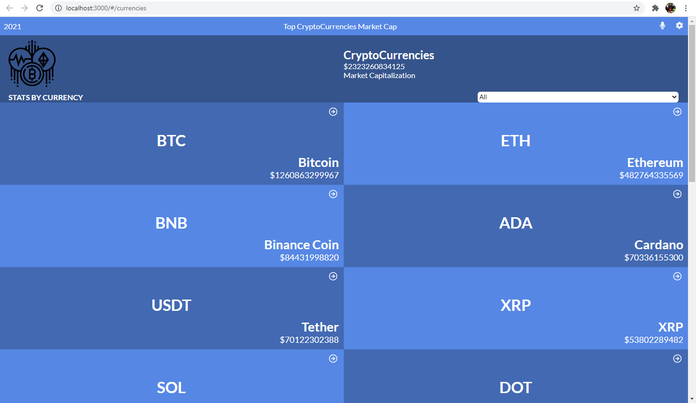
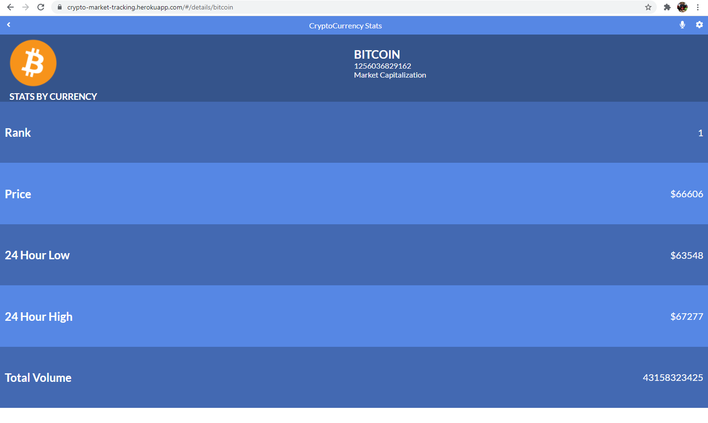
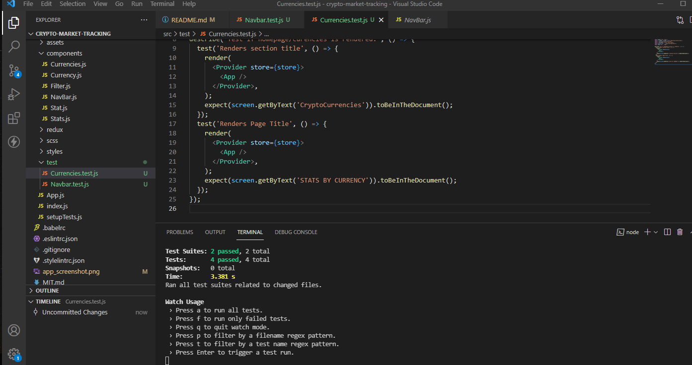

# Project Name

Crypto market traking

This is a mobile web application that displays the total market capital of the top ten crypto currencies in the world. Each individual currency can then be selected and the associated market value will be displayed for it. All data is requested from an API and then appended to the page.

## Built With

- 
- 
- 
- 
- 
- 

# Screenshots

## Live Demo

You can see my page live here:
[Check it out!](https://crypto-market-tracking.herokuapp.com/#/currencies)

## Getting Started

To get a local copy up and running follow these simple example steps. You can either download the zip file, or clone the repository from [here](https://github.com/herokudev/crypto-market-tracking.git). Once the repository is available locally you can use: `npm install` to install the packages `npm start` to run the server on local server.
To run tests `npm test` can be used.

## Authors

👨‍💻 **Herbert Orellana**
​
- GitHub: [@herokudev](https://github.com/herokudev)
- LinkedIn: [LinkedIn](https://www.linkedin.com/in/herbert-armando-orellana-a0b50b34/)
​
## Acknowledgment
Original design idea by Nelson Sakwa on Behance.

## Show your support

Give a ⭐️ if you like this project!
